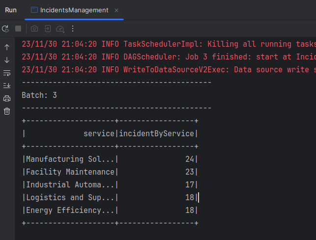

# Spark SQL

## Introduction 
Spark is a universal parallel computing framework developed by the UC Berkeley AMPLab in 2009, was open sourced in early 2010, and moved to the Apache Software Foundation in 2013. It is a fast, versatile, and scalable memory-based big data computing engine. 
MapReduce-based computing engines typically output intermediate results to disks for storage and fault tolerance. Spark stores intermediate results in memory to reduce the I/O of the underlying storage system and improve the computing speed. It is a one-stop solution that integrates batch processing, real-time stream processing, interactive query, graph computing, and machine learning. Spark can process data requirements in different scenarios, including batch processing, interactive query, real-time stream processing, and machine learning.  
Spark not only outperforms MapReduce, but also is compatible with the Hadoop ecosystem. It can run on Hadoop HDFS to provide enhanced functions. To some extent, Spark replaces Hadoop MapReduce. It is still compatible with YARN and Apache Mesos in Hadoop so existing Hadoop users can easily migrate their workloads to Spark.It typical Use Cases :
- Batch processing can be used for extracting, transforming, and loading (ETL).
- Machine learning can be used to automatically determine whether the comments of online buyers are positive or negative.
- Interactive analysis can be used to query the Hive warehouse.
- Stream processing can be used for real-time businesses analysis (such as page-click streams), recommendation systems, and public opinion analysis. 

## Spark Streaming
Spark Streaming is a stream processing system that performs high-throughput and faulttolerant processing on real-time data streams. It can perform complex operations such as map, reduce, and join on multiple data sources (such as Kafka, Flume, Twitter, Zero, and TCP sockets) and save the results to external file systems, databases, or real-time dashboards. 
The core idea of Spark Streaming is to split stream computing into a series of short batch jobs. The batch processing engine is Spark Core. That is, the input data of Spark Streaming is divided into segments based on a specified time slice (for example, 1 second), each segment is converted into RDDs in Spark, then the DStream conversion in Spark Streaming is transformed to the RDD conversion in Spark. As a result, the intermediate results of RDD conversion are saved in the memory. 
If real-time computing, a strong transaction mechanism, and dynamic parallelism adjustment are not required, Spark Streaming should be considered. Located in the Spark ecological technology stack, Spark Streaming can seamlessly integrate with Spark Core and Spark SQL. That is, delay batch processing, interactive query, and other operations can be performed immediately and seamlessly on immediate data that is processed in real time. This feature significantly enhances the advantages and functions of Spark Streaming.

## Spark Structured Streaming
Spark Structured Streaming is a streaming data processing engine built on Spark SQL. You can write streaming computing processes just like you would with static RDD data. When streaming data is continuously generated, Spark SQL processes the data incrementally and continuously and updates the results to the result set. The core of Structured Streaming is to regard streaming data as a database table where data is 
continuously increasing. Such a data processing model is similar to data block processing. It can apply some query operations of the static database table to streaming data computing. Spark executes standard SQL query statements to obtain data from an unbounded table.

## Objective
Developing a Spark application for the hospital that receives hospital incidents in streaming with Structured Streaming. Incidents are received streaming in csv files.

## Application
1. Incidents Management Data
<table >
    <thead>
        <tr>
            <th>Use Mockaroo To Generate Random Data</th>
            <th>Generated Data</th>
        </tr>
    </thead>
    <tbody>
        <tr>
            <td></td>
            <td></td>
        </tr>
    </tbody>
</table>
  

2. Number of Incidents per Service

<table >
    <thead>
        <tr>
            <th>Batch 0</th>
            <th>Batch 1</th>
        </tr>
        <tr>
            <th>Batch 2</th>
            <th>Batch 3</th>
        </tr>
    </thead>
    <tbody>
        <tr>
            <td></td>
            <td></td>
        </tr>
        <tr>
            <td></td>
            <td></td>
        </tr>
    </tbody>
</table>
  

3. Two Years With The Most Incidents

<table >
    <thead>
        <tr>
            <th>Batch 0</th>
            <th>Batch 1</th>
        </tr>
        <tr>
            <th>Batch 2</th>
            <th>Batch 3</th>
        </tr>
    </thead>
    <tbody>
        <tr>
            <td></td>
            <td></td>
        </tr>
        <tr>
            <td></td>
            <td></td>
        </tr>
    </tbody>
</table>
  
  

## License
[MIT License](LICENSE)

