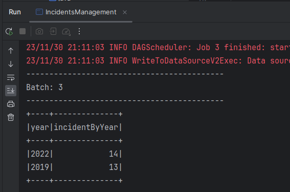
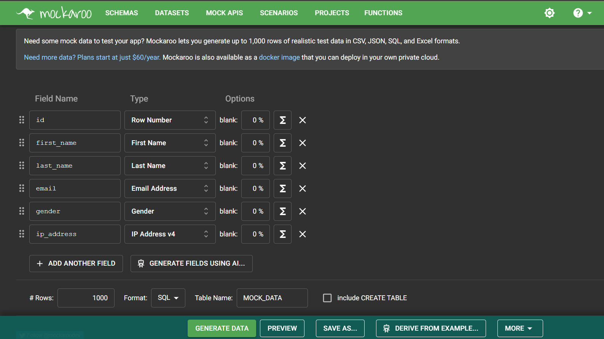
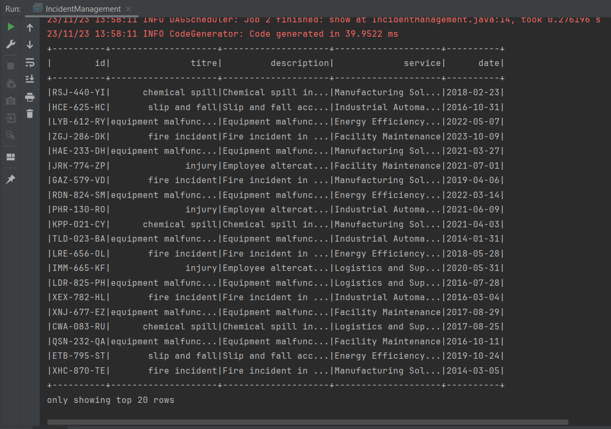
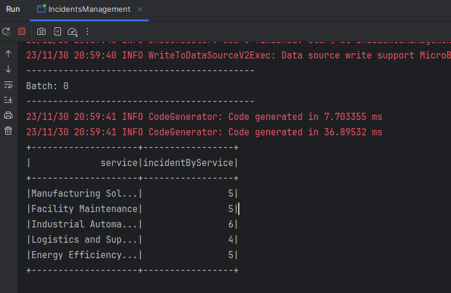
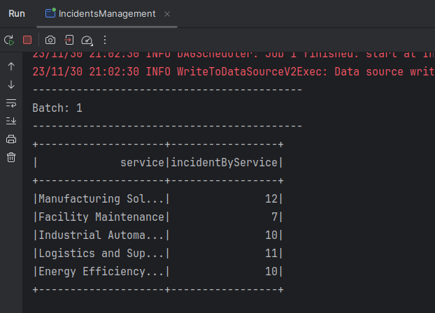
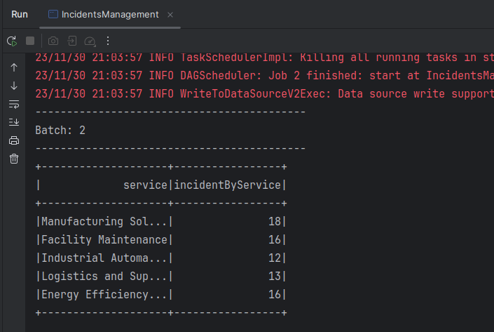
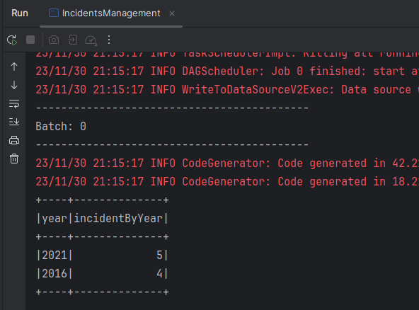
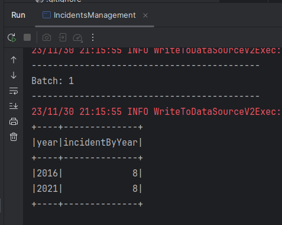
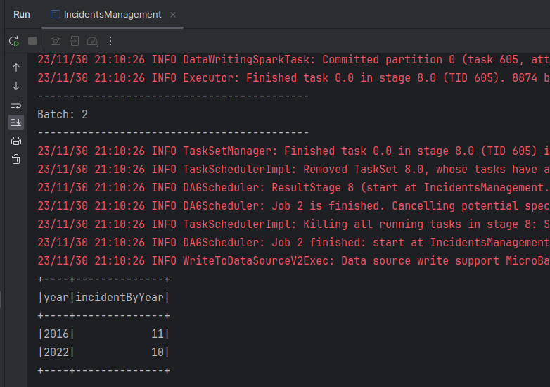

# Spark SQL

## Introduction 
Spark is a universal parallel computing framework developed by the UC Berkeley AMPLab in 2009, was open sourced in early 2010, and moved to the Apache Software Foundation in 2013. It is a fast, versatile, and scalable memory-based big data computing engine. 
MapReduce-based computing engines typically output intermediate results to disks for storage and fault tolerance. Spark stores intermediate results in memory to reduce the I/O of the underlying storage system and improve the computing speed. It is a one-stop solution that integrates batch processing, real-time stream processing, interactive query, graph computing, and machine learning. Spark can process data requirements in different scenarios, including batch processing, interactive query, real-time stream processing, and machine learning.  
Spark not only outperforms MapReduce, but also is compatible with the Hadoop ecosystem. It can run on Hadoop HDFS to provide enhanced functions. To some extent, Spark replaces Hadoop MapReduce. It is still compatible with YARN and Apache Mesos in Hadoop so existing Hadoop users can easily migrate their workloads to Spark.It typical Use Cases :
- Batch processing can be used for extracting, transforming, and loading (ETL).
- Machine learning can be used to automatically determine whether the comments of online buyers are positive or negative.
- Interactive analysis can be used to query the Hive warehouse.
- Stream processing can be used for real-time businesses analysis (such as page-click streams), recommendation systems, and public opinion analysis. 

## Spark SQL
Spark SQL allows developers to directly process RDDs and query external data stored in Hive and HBase. An important feature of Spark SQL is that it can process relational tables and RDDs in a unified manner so that developers can easily use SQL commands to perform external queries and more complex data analysis. Spark SQL uses a similar method to relational databases to process SQL statements. SparkSQL parses SQL statements to form a tree, and then uses rules to bind and optimize the tree. 
- Lexical and syntax parsing: Parses the lexical and syntax of the read SQL statements to identify keywords (such as SELECT, FROM, and WHERE), expressions, projections, and data sources, and then determines whether the SQL statement is standard and forms a logical plan.
- Bind: Spark SQL binds a SQL statement to a database's data dictionary (column, table, or view). If the related projection and data source exist, the statement can be executed.
- Optimize: Spark SQL provides several execution plans and returns the data sets obtained from the database. Execute: Spark SQL executes the optimal execution plan obtained in the previous step and returns the datasets obtained from the database.

## Objective
1. We want to develop a Spark application for an industrial company that processes incidents for each department. Incidents are stored in a csv file.
2. A hospital wants to process this data using a Spark application in a parallel and distributed manner. The hospital has data stored in a relational database and csv files. The objective is to process this data using Spark SQL through the DataFrame and Dataset APIs to extract useful information in order to make decisions.

## Application
1. Incidents Management Captures
<table >
    <thead>
        <tr>
            <th>Use Mockaroo To Generate Random Data</th>
            <th>Generated Data</th>
        </tr>
    </thead>
    <tbody>
        <tr>
            <td></td>
            <td></td>
        </tr>
    </tbody>
</table> 
<table >
    <thead>
        <tr>
            <th>Number of Incidents per Service</th>
            <th>Two Years With The Most Incidents</th>
        </tr>
    </thead>
    <tbody>
        <tr>
            <td></td>
            <td></td>
        </tr>
    </tbody>
</table>
  

2. Hospital Management Captures

<table >
    <thead>
        <tr>
            <th>Create DB Tables</th>
            <th>Use Mockaroo To Generate Random Data</th>
        </tr>
    </thead>
    <tbody>
        <tr>
            <td></td>
            <td></td>
        </tr>
    </tbody>
</table> 
<table >
    <thead>
        <tr>
            <th>Doctors Table</th>
            <th>Patients Table</th>
            <th>Consultations Table</th>
        </tr>
    </thead>
    <tbody>
        <tr>
            <td></td>
            <td></td>
            <td></td>
        </tr>
        <tr>
            <td></td>
            <td></td>
            <td></td>
        </tr>
    </tbody>
</table> 
<table >
    <thead>
        <tr>
            <th>Number of Consultations Per Day</th>
            <th>Number of Consultations Per Doctor</th>
            <th>Number of Patients That attended Each Doctor</th>
        </tr>
    </thead>
    <tbody>
        <tr>
            <td></td>
            <td></td>
            <td></td>
        </tr>
    </tbody>
</table>  

## License
[MIT License](LICENSE)

